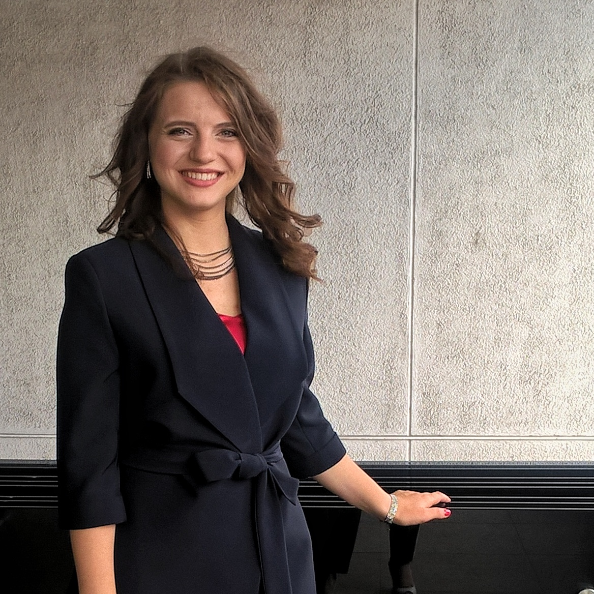

## **Varvara Gaponova** ##


---

### **Contact information** ###

1. **E-mail**: varvara.gaponova21091995@gmail.com
2. **Phone**: +375 25 796 50 83
3. **[GitHub](https://github.com/varvaragaponova)**
4. **Location**: Tbilisi, Georgia


---

### **About myself** ###

I would like to learn JavaScript and become a software engineer after graduation of this course. I am purposeful, industrious, sociable, interested in self-development and improvement of professional skills. 

### **Education** ###
1. Higher: 
   - Gomel State Medical University (2013 – 2019)
2. RS Schools Course «JavaScript/Front-end. Stage 0» (in progress).

### **Job** ###	
- children's doctor(from 2019 to 2022)

### **Skills** ###
-	CSS
-	HTML
-	Git
-	Markdown
-	Basic JavaScript

### **Code example** ###
```
    function updateLight(current) {
      if (current === 'red') {
        return 'green';
      } else if (current === 'yellow') {
        return 'red';
      } else if (current === 'green') {
        return 'yellow';
      } 
    }
```
### **Languages** ###
- *Russian*: native
- *English*: A2